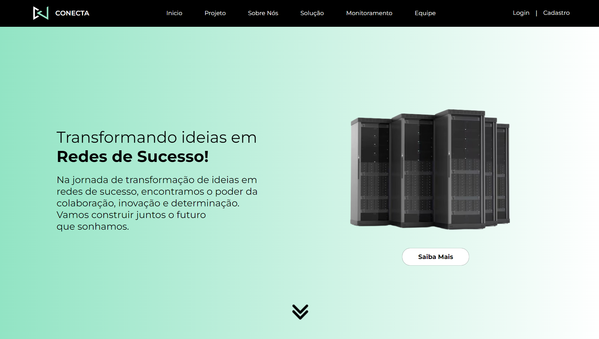
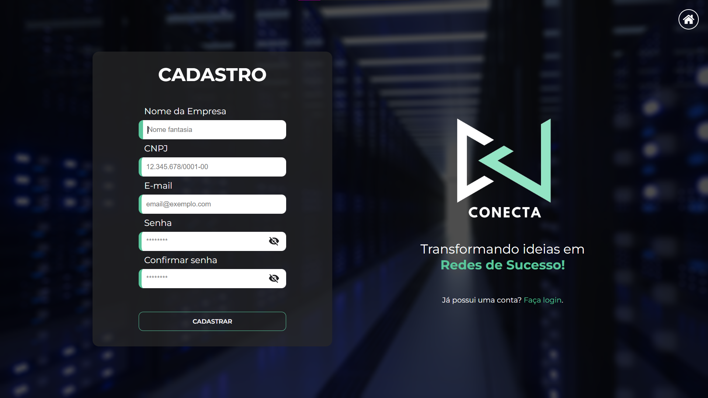

 

 
Projeto de Monitoramento de Servidores Hospitalares, baseado nos princípios do ITIL, garantindo a estabilidade dos serviços de saúde. Com um aplicativo cliente e uma plataforma web integrada, oferecemos monitoramento contínuo, identificando e resolvendo incidentes em tempo real. Priorizamos a gestão de incidentes e problemas para garantir a confiabilidade dos sistemas, proporcionando um ambiente seguro para pacientes e profissionais de saúde.

 

## 🚀 Tecnologias utilizadas

### Front-end:

 

  

 ### Back-end:
 

  

 ### DevOps:

  
 

 

## 📷 Screenshots

 

 

 

 

## 👥 Equipe 

<table align = "center">
  
<td  align="center"><a  href= "https://github.com/CamyAlves"> <b> Camilly Alves </b></a> <a  href="https://github.com/CamyAlves" > </a>
</td>

<td  align="center"><a  href= "https://github.com/ezpmartins" > <b> Enzo Martins </b></a> <a  href="https://github.com/ezpmartins" > </a>
</td>

<td  align="center"><a  href="https://github.com/gabrielhgbarreto" > <b> Gabriel Barreto </b></a> <a  href="https://github.com/gabrielhgbarreto" > </a>
</td>

<td  align="center"><a  href="https://github.com/leOhsantos" > <b> Leonardo Santos </b></a> <a  href="https://github.com/leOhsantos" > </a>
</td>

<td  align="center"><a  href="https://github.com/PatrickRodrigues19" > <b> Patrick de Lima </b></a> <a  href="https://github.com/PatrickRodrigues19" > </a>
</td>

</table>
