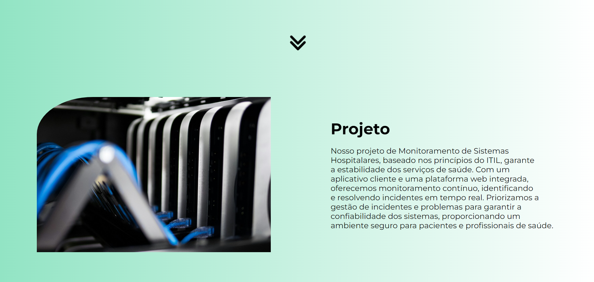
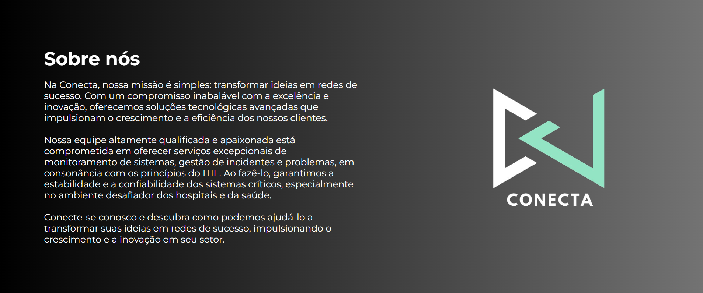
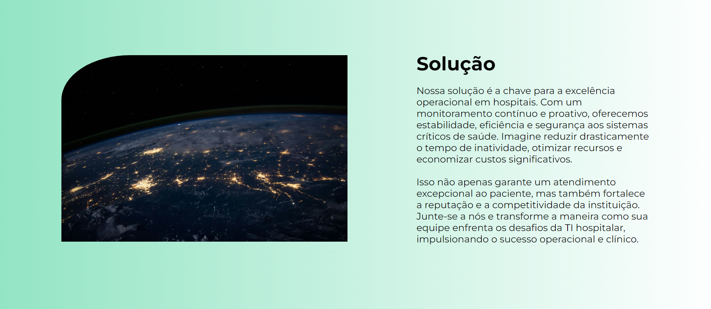
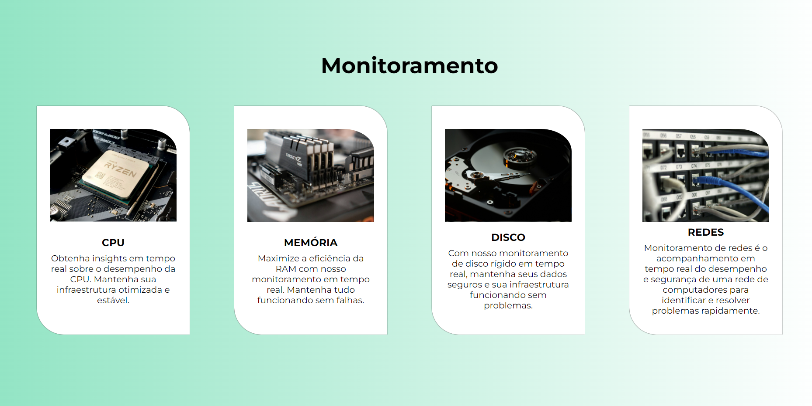
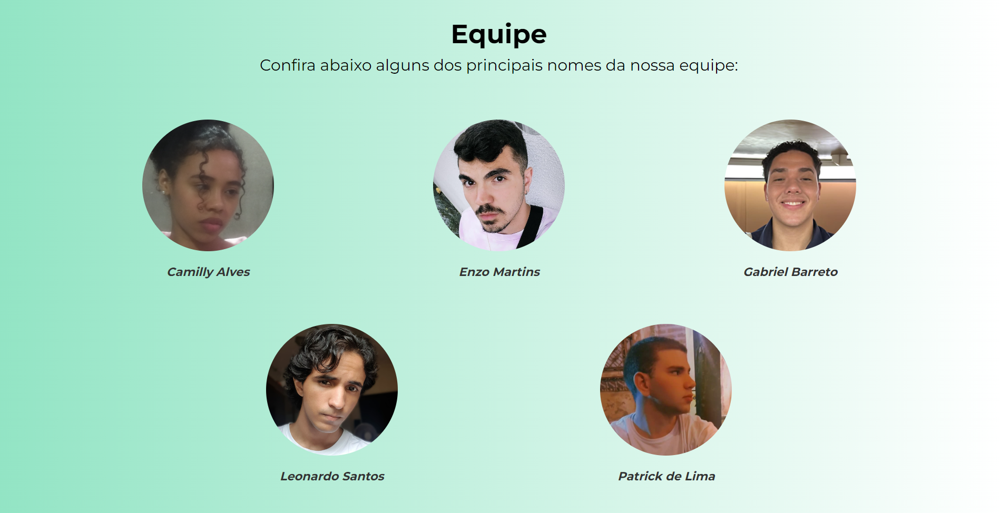
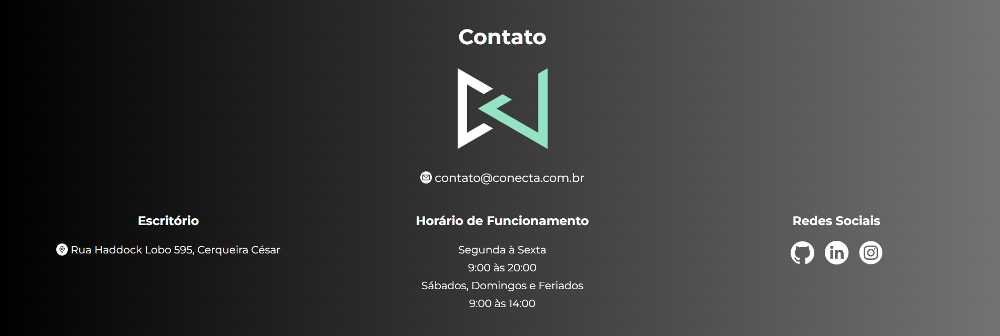

<div align="center">

</div>

<br>

Nosso projeto de Monitoramento de Sistemas Hospitalares, baseado nos princípios do ITIL,garantindo a estabilidade dos serviços de saúde. Com um aplicativo cliente e uma plataforma web integrada,oferecemos monitoramento contínuo, identificando e resolvendo incidentes em tempo real. Priorizamos a gestão de incidentes e problemas para garantir a confiabilidade dos sistemas, proporcionando um ambiente seguro para pacientes e profissionais de saúde.
<br>

## 🚀 Tecnologias utilizadas

### Front-end:

<div align="left">


 ### Back-end:


</div>

<br>

## 📷 Screenshots


<br>



<br>



<br>



<br>



<br>



<br>



## ⚙ Instalação local

### Requisitos para a instalação:


### Para a configuração do banco de dados:

- Execute todo esse <a href="project/src/database/one-piece-quiz-script.sql">script</a> para a configuração do banco de dados.

### Instale as dependências do projeto:
```bash
npm i
```

### Após a instalação de todas as dependências:
```bash
npm start
```

### Por fim, para abrir o projeto:

- Acesse a seguinte URL: http://localhost:3333

## 👥 Equipe 

<table>
  
<td  align="center"><a  href= "https://github.com/CamyAlves"><br/><sub><b> Camilly Alves </b></sub></a><br /><a  href="https://github.com/CamyAlves" ></a>
</td>


<td  align="center"><a  href= "https://github.com/ezpmartins" ><br/><sub><b> Enzo Martins </b></sub></a><br /><a  href="https://github.com/ezpmartins" ></a>
</td>


<td  align="center"><a  href="https://github.com/gabrielhgbarreto" ><br/><sub><b> Gabriel Barreto </b></sub></a><br /><a  href="https://github.com/gabrielhgbarreto" ></a>
</td>


<td  align="center"><a  href="https://github.com/leOhsantos" ><br/><sub><b> Leonardo Santos </b></sub></a><br /><a  href="https://github.com/leOhsantos" ></a>
</td>


<td  align="center"><a  href="https://github.com/PatrickRodrigues19" ><br/><sub><b> Patrick de Lima </b></sub></a><br /><a  href="https://github.com/PatrickRodrigues19" ></a>
</td>


</table>
